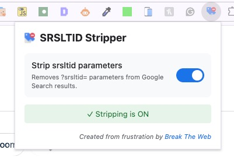

# SRSLTID Stripper

A Chrome extension that removes `?srsltid=` tracking parameters from Google Search results.

## What it does

When you search on Google, the search results often include tracking parameters like `?srsltid=` appended to URLs. This extension automatically strips these parameters, giving you cleaner URLs and reducing tracking.

### Features

- ✅ Automatically removes `?srsltid=` parameters from all Google Search result links
- ✅ Works when copying links or clicking through to websites
- ✅ Simple toggle to enable/disable the stripping functionality
- ✅ Supports 20+ Google domains (google.com, google.co.uk, google.ca, etc.)

## Installation

### From Source

1. Download or clone this repository
2. Open Chrome and navigate to `chrome://extensions/`
3. Enable "Developer mode" (toggle in the top-right corner)
4. Click "Load unpacked"
5. Select the folder containing the extension files

## Usage

1. After installing, click the extension icon in your Chrome toolbar
2. The extension is enabled by default
3. Toggle the switch to turn stripping on or off
4. Search on Google and enjoy cleaner URLs!

## Supported Google Domains

The extension works on:
- google.com
- google.co.uk
- google.ca
- google.com.au
- google.de
- google.fr
- google.es
- google.it
- google.co.in
- google.co.jp
- google.com.br
- google.com.mx
- google.nl
- google.ru
- google.pl
- google.com.tr
- google.co.id
- google.com.ar
- google.se
- google.ch

## Files

- `manifest.json` - Extension configuration
- `content.js` - Main script that strips the parameters
- `popup.html` - Extension popup interface
- `popup.js` - Popup functionality
- `icon-16.png`, `icon-48.png`, `icon-128.png` - Extension icons

## Privacy

This extension:
- ✅ Does NOT collect any data
- ✅ Does NOT send any information to external servers
- ✅ Only modifies URLs locally in your browser
- ✅ Source code is open and auditable

## Credits

Created from frustration by [Break The Web](https://breaktheweb.agency)
